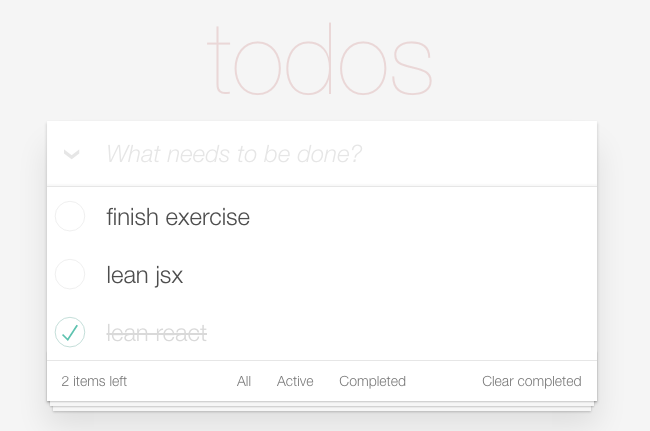

## todoList初级版

根据一个 JSON 对象，用 React JSX 的方式渲染出 [TODOMVC](http://todomvc.com/examples/react/#/) 页面:



JSON 对象如下：

```javascript
var todolist = {
    name: "todos",
    todos: [{
            completed: false,
            title: 'finish exercise'
        }, {
            completed: false,
            title: 'lean jsx'
        }, {
            completed: true,
            title: 'lean react'
        }]
}
```

### 资源推荐
[精益 React 学习指南 （Lean React）- 1.2 JSX 语法](https://segmentfault.com/a/1190000005145610)


